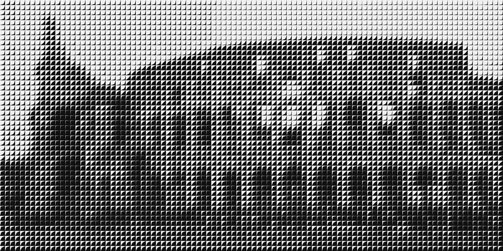
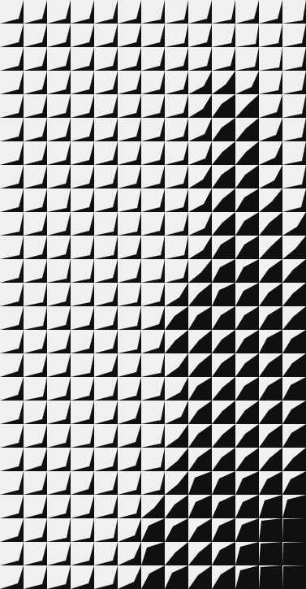
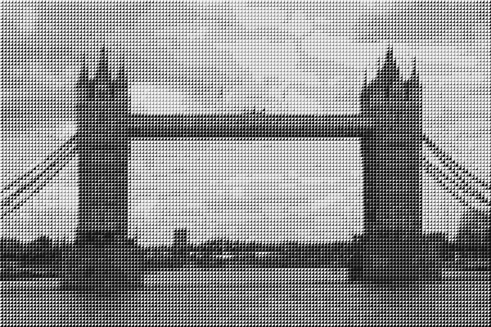

# DartArt
Convert image pixels to small darts, pixel luminance is mapped to convexness of the dart.

Inspired by the book [Opt Art](https://press.princeton.edu/books/hardcover/9780691164069/opt-art) by Robert Bosch.

## Introduction

Converting images to "DartArt" consists of two steps.
First, an image is converted from color (RGB) to gray (liminance).
Next, every gray pixel is converted to a small dart.

The figure below shows darts with increasing "convexness" (and thus increasing darkness).

The whole application is implemented in javascript.
Just (download and) click [dartart.html](dartart.html).

## Examples

The demo comes with two examples

### Colosseum

### Tower bridge

(end)
